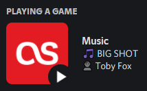

# fmcord

**Display your current Last.FM song on Discord using the RPC API:**

Based on [fmcord by 69](https://github.com/69/fmcord)

## Dependencies

- [NodeJS](https://nodejs.org/en/)
- [Discord](https://discord.com/)

## Setup

- Clone the repo `git clone https://github.com/faynealdan/fmcord.git`
- Install the modules `npm i`
- Open Discord
- Copy `config.example.json` to `config.json`
- Set your last.fm username in the `config.json` file
- Start the RPC app `node app`

## Useful links

- [RPC API Documentation](https://discordapp.com/developers/docs/topics/rpc)
- [Rich Presence Documentation](https://discordapp.com/developers/docs/rich-presence/how-to)

## Troubleshooting

### It says the song is being updated but it isn't being displayed on my profile?

- Go to Discord settings
- Go to "Games"
- Make sure "Display currently running game as a status message" is ticked

### How to run in the background

- Install pm2 `npm i pm2 -g`
- Start the app `pm2 start app.js --name="fmcord"`
- Use `pm2 log fmcord` to view the logs
- Restart the app using `pm2 restart fmcord`
- To stop it, run `pm2 stop fmcord`
